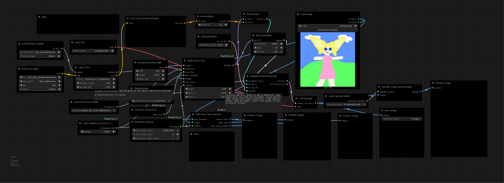

---
tags:
  - github
  - comfyui
  - tutorial
---

# AI Portrait T-Shirt — ComfyUI + PuLID + CARICATUNER F1

> Ghid complet pentru a genera un design de tricou personalizat cu AI pe serverul tău.
> De folosit ca resursă GitHub alături de clipul YouTube.



> Drag & drop `preview.png` into ComfyUI to load the full workflow automatically.

---

## Ce vei obține

O caricatură sau portret artistic generat din poza ta, rezoluție print-ready (~4000×4096px), gata pentru Printful sau orice serviciu DTG.

---

## Cerințe

- **GPU:** NVIDIA cu minim 12GB VRAM (recomandat 16GB+; testat pe RTX 3090 24GB)
- **RAM:** minim 16GB
- **Spațiu disc:** ~30GB pentru toate modelele
- **OS:** Linux (testat pe Bazzite/Fedora). Pe Windows: pașii sunt identici, doar căile diferă.
- **ComfyUI:** instalat și funcțional

> Cu 12GB VRAM merge în modul fp8 (mai lent). Sub 12GB → Flux Dev nu rulează.
> Pe CPU funcționează dar durează ore vs. minute.

---

## Pas 1: HuggingFace token (pentru modele gated)

Flux Dev și PuLID necesită un cont HuggingFace și acceptarea licenței înainte de descărcare.

1. Creează cont pe [huggingface.co](https://huggingface.co) (gratuit)
2. Acceptă licența pe pagina fiecărui model gated (buton „Agree and access repository")
3. **Profile → Settings → Access Tokens → New token** → Read → Create → copiezi token-ul
4. În ComfyUI: **Manager → Settings → HuggingFace API Token** → lipești → Save

De acum **Manager → Model Manager** poate descărca modele direct, fără comenzi.

---

## Modele necesare

### 1. Flux Dev (modelul de bază)
```
ComfyUI/models/checkpoints/flux1-dev.safetensors
```
Descarcă de pe HuggingFace: `black-forest-labs/FLUX.1-dev`

> Necesită acceptarea licenței pe HuggingFace (cont gratuit).

### 2. CLIP encoders (pentru Flux)
```
ComfyUI/models/clip/t5xxl_fp8_e4m3fn.safetensors
ComfyUI/models/clip/clip_l.safetensors
```
Descarcă de pe: `comfyanonymous/flux_text_encoders` pe HuggingFace

### 3. VAE (pentru Flux)
```
ComfyUI/models/vae/ae.safetensors
```
Descarcă de pe: `black-forest-labs/FLUX.1-dev` (același repo ca modelul de bază)

### 4. PuLID Flux v0.9.1 (identitate facială)
```
ComfyUI/models/pulid/pulid_flux_v0.9.1.safetensors
```
Descarcă de pe: `guozinan/PuLID` pe HuggingFace

### 5. AntelopeV2 (necesar pentru PuLID — face detection)
```
ComfyUI/models/insightface/models/antelopev2/
```
Descarcă: `antelopev2.zip` de pe `huggingface.co/MonsterMMORPG/tools` → dezarhivează în folderul de mai sus

### 6. CARICATUNER F1 LoRA (stilul caricatură)
```
ComfyUI/models/loras/caricatuner_f1.safetensors
```
Descarcă de pe: `civitai.com/models/845868`

### 7. 4x-UltraSharp (upscale pentru print)
```
ComfyUI/models/upscale_models/4x-UltraSharp.pth
```
Descarcă de pe: `huggingface.co/lokCX/4x-UltraSharp`

> Fără acesta workflow-ul crapă la pasul de upscale. Mărește imaginea de la ~1024px la ~4000px cu detalii reale (față, textură, contur).

---

## Custom nodes necesare

**Varianta simplă (recomandat) — prin Manager:**
Manager → Install Missing Custom Nodes → caută `PuLID` → Install → Restart ComfyUI

**Varianta manuală:**
```bash
cd ComfyUI/custom_nodes
git clone https://github.com/lldacing/ComfyUI_PuLID_Flux_ll.git
cd ComfyUI_PuLID_Flux_ll && pip install -r requirements.txt && cd ..
```
Restart ComfyUI după instalare.

---

## Noduri roșii după deschiderea workflow-ului

Dacă deschizi fișierul JSON (sau un PNG cu workflow embedded) și apar noduri colorate în roșu — înseamnă că îți lipsesc custom nodes.

**Fix:**
1. Manager → **Install Missing Custom Nodes**
2. Bifează tot ce găsește → Install
3. Restart ComfyUI
4. Redeschide workflow-ul

> Dacă tot apar noduri roșii după restart: dă click pe nodul roșu → citești numele exact → cauți manual pe GitHub → instalezi.

---

## Workflow — noduri și conexiuni

### Structura workflow-ului

```
[DualCLIPLoader] ──────────────────────────────────────────┐
   t5xxl_fp8_e4m3fn.safetensors                            │
   clip_l.safetensors                                       ▼
                                                    [Load LoRA]
[Load Diffusion Model] ─────────────────────────►  caricatuner_f1
   flux1-dev.safetensors                            strength: 0.90
         │                                                  │
         │                           ┌────────────────── model
         ▼                           ▼                      │
   [Apply PuLID Flux] ◄──── [Load Image] (poza ta)         │
   weight: 0.90                                             │
   start_at: 0.1                                            │
   end_at: 0.9                                              │
         │                                                  │
         └──────────────► [SamplerCustomAdvanced] ◄─────────┘
                                    │
                              [Preview Image]
```

### Noduri în detaliu

**DualCLIPLoader**
- clip_name1: `t5xxl_fp8_e4m3fn.safetensors`
- clip_name2: `clip_l.safetensors`
- type: `flux`

**Load Diffusion Model**
- unet_name: `flux1-dev.safetensors`
- weight_dtype: `fp8_e4m3fn` (dacă ai sub 16GB VRAM) sau `default`

**Load LoRA**
- lora_name: `caricatuner_f1.safetensors`
- strength_model: `0.90`
- strength_clip: `1.0`

**Apply PuLID Flux**
- weight: `0.90`
- start_at: `0.1`
- end_at: `0.9`
- fusion: `mean`
- fusion_weight: `1.0`

**BasicScheduler**
- scheduler: `simple`
- steps: `30`
- denoise: `1.0`

**KSamplerSelect**
- sampler_name: `euler`

**FluxGuidance**
- guidance: `3.0`

**EmptySD3LatentImage**
- width: `768`
- height: `1024`
- batch_size: `1`

**RandomNoise**
- noise_seed: orice număr (sau `randomize` pentru explorare)

---

## Setări câștigătoare (testate)

| Parametru | Valoare |
|---|---|
| PuLID weight | 0.90 |
| PuLID start_at | 0.1 |
| PuLID end_at | 0.9 |
| LoRA strength_model | 0.75–1.10 |
| Steps | 30 |
| Scheduler | simple |
| Sampler | euler |
| Guidance | 3.0 |
| Rezoluție | 768 × 1024 |

**Pentru exagerare maximă (stil comic):** LoRA strength 1.2, guidance 3.5

---

## Prompt câștigător

```
caricature portrait, big head tiny body, man riding motorcycle on alpine mountain road, wide grin, backpack, winding road, mountain peaks, cartoon illustration, vintage cream vignette border, soft faded edges, t-shirt print design, no text, no letters, no words
```

### Structura recomandată

```
[stil caricatură] portrait, [persoană + trăsături exagerate],
[acțiune + locație], [background], [lumină], [stil vizual],
[efect margini], t-shirt print design, no text, no letters, no words
```

### Keywords pentru exagerare față

```
big head small body          ← proporție clasică
enormous head tiny body      ← exagerare extremă
oversized thick glasses      ← ochelari supradimensionați
giant ears                   ← urechi mari
huge wide grin               ← zâmbet larg
expressive eyes              ← ochi expresivi
```

### Ce să NU combini

- `sunset light` + `storm clouds`
- `vivid colors` + `flat colors`
- `young man` dacă vrei asemănare cu persoana din poză
- mai mulți modificatori de lumină simultan

---

## Ajustări în funcție de rezultat

| Dacă... | Fă... |
|---|---|
| Față prea puțin recunoscută | Urcă PuLID weight → 0.95–1.0 |
| Față prea rigidă | Scade PuLID weight → 0.75 sau start_at → 0.3 |
| Caricatură prea subtilă | Urcă LoRA strength → 1.1–1.2 |
| Caricatură prea exagerată | Scade LoRA strength → 0.60–0.70 |
| Prea fotorealist | Adaugă: `cartoon style, bold graphic illustration` |
| Fundal prea aglomerat | Adaugă: `simple background, minimal background` |

---

## Post-procesare (Photopea)

1. Deschide PNG-ul generat la `photopea.com`
2. **Layer → Add Layer Mask**
3. **Gradient Tool (G)** → Radial → Black to White
4. Drag din centru spre colț → fade spre transparent
5. **File → Export As → PNG** (păstrează transparența)

**Alternativ direct din prompt** (mai simplu):
```
vintage cream vignette border, soft faded edges, aged paper texture
```

---

## Comandă pe Printful

1. `printful.com` → Products → T-shirts → **Unisex Classic Tee Gildan 5000** (~€6.25 + shipping)
2. Upload PNG cu fundal transparent → **DTG printing**
3. Alege culoarea 
4. Checkout → livrare EU: 3–4 zile (depozit Latvia)

---

## Workflow JSON

> [doru_workflow.json](doru_workflow.json) — importă direct în ComfyUI prin drag & drop sau Load

---

## Backup — ce salvezi și unde

### Fișiere mici (backup imediat)

| Fișier | Dimensiune | Unde |
|---|---|---|
| Workflow JSON (acest fișier) | câțiva KB | GitHub sau Google Drive |
| `caricatuner_f1.safetensors` | 38MB | Google Drive / NAS — **prioritate**, poate dispărea de pe Civitai |

### Modele mari (nu faci backup fizic — documentezi linkurile)

| Model | Unde îl reiei |
|---|---|
| `flux1-dev.safetensors` | huggingface.co/black-forest-labs/FLUX.1-dev (cont + licență) |
| `pulid_flux_v0.9.1.safetensors` | huggingface.co/guozinan/PuLID |
| `t5xxl_fp8_e4m3fn.safetensors` + `clip_l.safetensors` | huggingface.co/comfyanonymous/flux_text_encoders |
| `ae.safetensors` (VAE) | huggingface.co/black-forest-labs/FLUX.1-dev |
| AntelopeV2 | huggingface.co/MonsterMMORPG/tools |

Custom nodes: `pip install` din GitHub — linkuri în secțiunea de instalare de mai sus.

---

## Resurse

- [ComfyUI](https://github.com/comfyanonymous/ComfyUI)
- [PuLID Flux](https://github.com/lldacing/ComfyUI_PuLID_Flux_ll)
- [CARICATUNER F1](https://civitai.com/models/845868)
- [Flux Dev pe HuggingFace](https://huggingface.co/black-forest-labs/FLUX.1-dev)
- [RunPod](https://www.runpod.io)
- [fal.ai](https://fal.ai)
- [Printful](https://www.printful.com)

---

*Creat: 2026-06-26 | Testat pe RTX 3090 + ComfyUI + Flux Dev*
